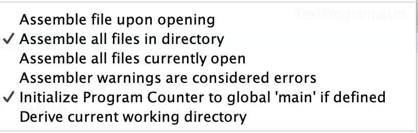

# Хавронич Евгений Алексеевич, БПИ226
### Условие:
Разработать подпрограмму, которая выводит на индикатор цифрового блока цифру, передаваемую через регистр a0. Адрес (левого или правого) индикатора задается в регистре a1. Если число в регистре a0 превышает шестнадцатиричную цифру, то учесть только младшие 4 разряда и выводить дополнительно точку. Для демонстрации написать программу, вызывающую эту подпрограмму, которая в цикле с задержкой (sleep), каждую секунду выводит по циклу очередное значение на один, а затем на другой индикатор.
### Задание выполнено на 8 баллов
### Программы:
Программы на ассемблере с комментариями размещены непосредственно в репозитории

Для запуска необходимо открыть файл [MainProgram.asm](MainProgram.asm) и убедиться, что во вкладке settings проставлены следующие галочки:

, а также, что подключены индикаторы.

Это необходимо для корректной работы global меток.
После этого запускаем сборку данного файла и следуем требованиям программы в консоли.
### Алгоритм главной программы:
1. Устанавливаем начальные значения для числа и выбора индикатора
2. Входим в цикл и вызываем подпрограмму [ShowNumberOnIndex](SubProgram.asm)
3. Увеличиваем значения, описанные выше
4. Вызываем sleep на 1 секунду
5. Возвращаемся обратно в начало цикла
6. Для выхода из программы пользователю необходимо самостоятельно остановить программу.

### Алгоритм подпрограммы:
1. Проверяем, больше ли число 16-ричной цифры. Если больше, то берём 4 младших разряда.
2. Определяем, какой из индикаторов используется, и направляем в соответствующие блоки кода
3. Для левого индикатора берём разряд десятков от числа и вызываем макрос [ReturnDigitForInd](macrolib.s).
4. Для правого индикатора берём разряд единиц от числа и вызываем макрос [ReturnDigitForInd](macrolib.s).
5. В каждом из блоке после вызова макросов осуществляем запись цифры на индикатор и возвращаемся из подпрограммы.

### Алгоритм ReturnDigitForInd:
1. Берём цифру и в услових последовательно от 0 до 9 определяем, какой она цифрой является.
2. При нахождении, возвращаем число, которое нужно записать в индикатор для записи данной цифры (прибавляем определённое число, если переданное число изначально было больше 16-ричной цифры)

### Объяснение результатов:
Так как мы поочерёдно вызываем сначала левый, а потом правый индикатор, начиная от 0, то у нас на долю чётных будет выпадать левый индикаторе, который будет принимать значения от 0 до 1 (затем от 0 до 1, но с точкой), так как в разряде десятков не может быть значений больше.
В правом же индикаторе будут показываться нечётные цифры.
При желании можно в главной программе в li с регистром t0 поставить вместо 0 – 1, и тогда в правом индикаторе будут показываться чётные числа.

Так или иначе, программа со своей задачей справилась.
